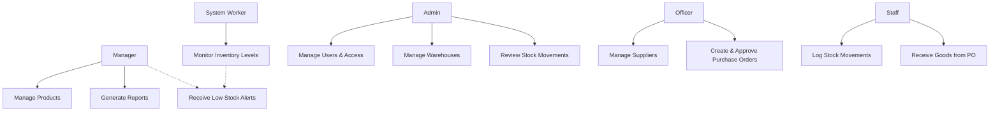
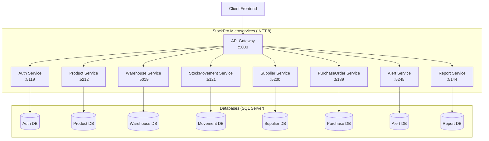
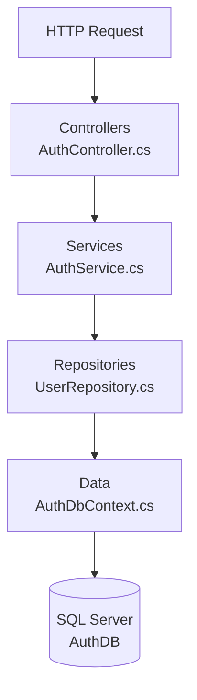
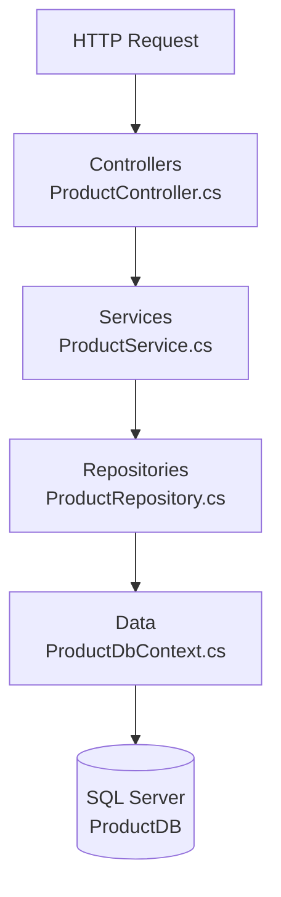
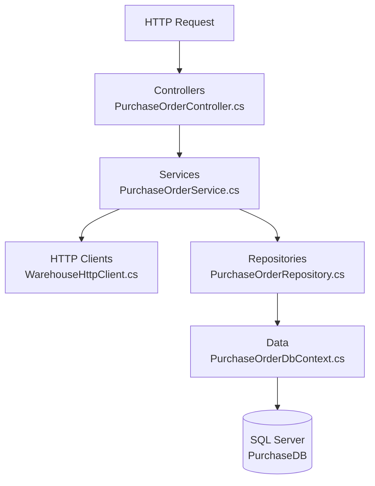
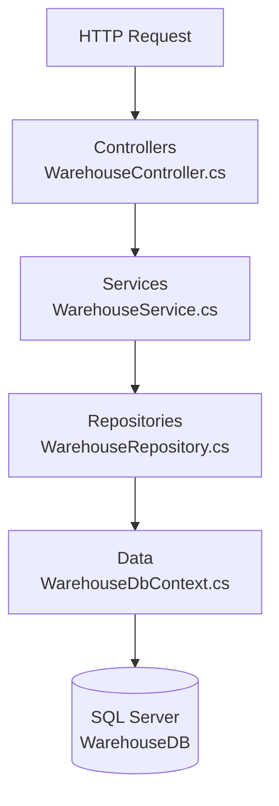
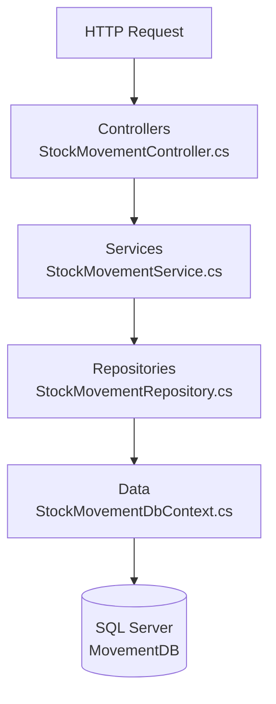
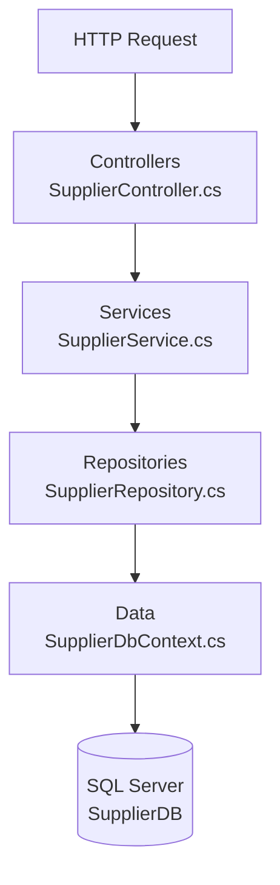
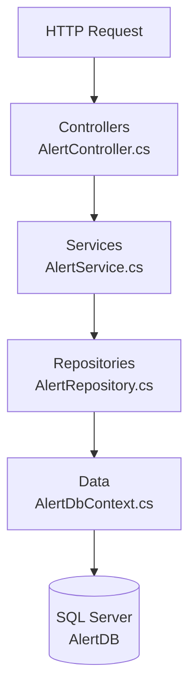
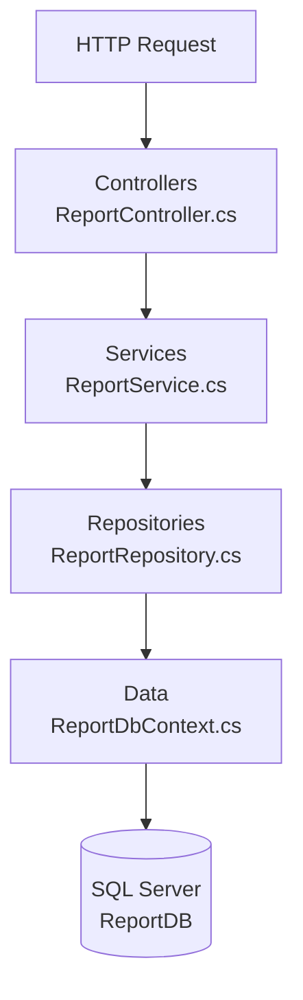

# StockPro — Backend API

> A microservices-based inventory management system built with **ASP.NET Core**, **Entity Framework Core**, **SQL Server**, and an **Ocelot API Gateway**.

---

## System Use Case Diagram

The following diagram outlines the overarching use cases across the entire StockPro platform, mapping all system actors (Admin, Manager, Officer, Staff, System) to their respective capabilities.



---

## Microservices Architecture & Connectivity



Each service follows a consistent layered structure:

```
ServiceName/
├── Controllers/      # HTTP endpoints
├── Services/         # Business logic
├── Repositories/     # Data access layer
├── Entities/         # EF Core models
├── DTOs/             # Request / response models
├── Data/             # DbContext
├── Middleware/       # Global exception handling
└── Migrations/       # EF Core migrations
```

---

## Microservice Internal Workflows (File-to-File Flow)

The following diagrams illustrate the internal execution flow of files within each microservice when an API request is received. The architecture follows a strict Controller -> Service -> Repository -> Database pattern to ensure separation of concerns.

### 1. Auth Service Flow


### 2. Product Service Flow


### 3. Purchase Order Service Flow


### 4. Warehouse Service Flow


### 5. Stock Movement Service Flow


### 6. Supplier Service Flow


### 7. Alert Service Flow


### 8. Report Service Flow


---

## Data Architecture (ER Diagram)

This section provides a logical Entity-Relationship (ER) diagram for the StockPro system. 
**Note:** Because StockPro uses a Database-per-Service architecture, these entities actually live in physically separate SQL Server databases. The relationships mapped here (like `PurchaseOrder` -> `Supplier`) are "logical" relationships that your microservices handle programmatically via IDs.

```mermaid
erDiagram
    %% Entities
    APP_USER {
        uniqueidentifier UserId PK
        string FullName
        string Email
        string PasswordHash
        string Phone
        string Role
        string Department
        boolean IsActive
        datetime CreatedAt
        datetime LastLoginAt
    }

    PRODUCT {
        uniqueidentifier ProductId PK
        string Sku
        string Name
        string Description
        string Category
        string Brand
        string UnitOfMeasure
        float CostPrice
        float SellingPrice
        int ReorderLevel
        int MaxStockLevel
        int LeadTimeDays
        string ImageUrl
        boolean IsActive
        string Barcode
    }

    SUPPLIER {
        int SupplierId PK
        string Name
        string ContactPerson
        string Email
        string Phone
        string Address
        string City
        string Country
        string TaxId
        string PaymentTerms
        int LeadTimeDays
        float Rating
        boolean IsActive
    }

    WAREHOUSE {
        int WarehouseId PK
        string Name
        string Location
        string Address
        int ManagerId FK
        int Capacity
        int UsedCapacity
        boolean IsActive
        string Phone
        datetime CreatedAt
    }

    STOCK_LEVEL {
        int StockId PK
        int WarehouseId FK
        uniqueidentifier ProductId FK
        int Quantity
        int ReservedQuantity
        string Location
        datetime LastUpdated
    }

    STOCK_MOVEMENT {
        int MovementId PK
        uniqueidentifier ProductId FK
        int WarehouseId FK
        string MovementType
        int Quantity
        string ReferenceType
        int ReferenceId
        float UnitCost
        uniqueidentifier PerformedBy FK
        string Notes
        datetime MovementDate
        int BalanceAfter
    }

    PURCHASE_ORDER {
        int PoId PK
        int SupplierId FK
        int WarehouseId FK
        uniqueidentifier CreatedById FK
        string Status
        float TotalAmount
        datetime OrderDate
        datetime ExpectedDate
        datetime ReceivedDate
        string Notes
        string ReferenceNumber
    }

    PO_LINE_ITEM {
        int LineItemId PK
        int PoId FK
        uniqueidentifier ProductId FK
        int Quantity
        float UnitCost
        float TotalCost
        int ReceivedQty
    }

    INVENTORY_SNAPSHOT {
        int SnapshotId PK
        int WarehouseId FK
        uniqueidentifier ProductId FK
        int Quantity
        float StockValue
        date SnapshotDate
        datetime CreatedAt
    }

    ALERT {
        int AlertId PK
        int RecipientId FK
        string Type
        string Severity
        string Title
        string Message
        uniqueidentifier RelatedProductId FK
        int RelatedWarehouseId FK
        string Channel
        boolean IsRead
        boolean IsAcknowledged
        datetime CreatedAt
    }

    %% Logical Relationships
    PURCHASE_ORDER ||--o{ PO_LINE_ITEM : "contains"
    SUPPLIER ||--o{ PURCHASE_ORDER : "supplies"
    WAREHOUSE ||--o{ PURCHASE_ORDER : "receives"
    APP_USER ||--o{ PURCHASE_ORDER : "creates"
    
    PRODUCT ||--o{ PO_LINE_ITEM : "ordered in"
    PRODUCT ||--o{ STOCK_LEVEL : "stocked as"
    WAREHOUSE ||--o{ STOCK_LEVEL : "holds"
    
    PRODUCT ||--o{ STOCK_MOVEMENT : "moves"
    WAREHOUSE ||--o{ STOCK_MOVEMENT : "tracked in"
    APP_USER ||--o{ STOCK_MOVEMENT : "performed by"
    
    PRODUCT ||--o{ INVENTORY_SNAPSHOT : "recorded in"
    WAREHOUSE ||--o{ INVENTORY_SNAPSHOT : "recorded for"
    
    PRODUCT ||--o{ ALERT : "triggers"
    WAREHOUSE ||--o{ ALERT : "triggers"


## Services

| Service | Port | Responsibility |
|---|---|---|
| **ApiGateway** | 5000 | Single entry point, routes all requests via Ocelot |
| **AuthService** | 5119 | User authentication, JWT token issuance, role management |
| **ProductService** | 5212 | Product catalog CRUD |
| **WarehouseService** | 5019 | Warehouse management and stock levels |
| **StockMovementService** | 5121 | Track stock movements (in/out/transfer) |
| **SupplierService** | 5230 | Supplier management |
| **PurchaseOrderService** | 5189 | Purchase order lifecycle |
| **AlertService** | 5245 | Low-stock and threshold alerts |
| **ReportService** | 5144 | Reporting and analytics |

---

## Tech Stack

- **Runtime**: .NET 8 / ASP.NET Core
- **ORM**: Entity Framework Core
- **Database**: SQL Server (SQL Express for local dev)
- **API Gateway**: Ocelot
- **Auth**: JWT Bearer tokens
- **API Docs**: Swagger / OpenAPI (per service)

---


## Authentication & Authorization

- JWT tokens are issued by **AuthService** on successful login.
- Tokens include the user's **role** (`Admin` / `User`).
- Every downstream service validates the JWT independently.
- Role-based access is enforced at the controller level via `[Authorize(Roles = "...")]`.

> **Note:** User registration is restricted to administrators only. New accounts must be created by an existing admin.

---

## Testing

Each service has a corresponding test project (e.g., `AuthService.Tests`, `ProductService.Tests`).

Run all tests from the solution root:

```bash
dotnet test
```

---

## Project Structure

```
StockPro/
├── ApiGateway/
├── AuthService/
├── AuthService.Tests/
├── ProductService/
├── ProductService.Tests/
├── WarehouseService/
├── WarehouseService.Tests/
├── StockMovementService/
├── StockMovementService.Tests/
├── SupplierService/
├── SupplierService.Tests/
├── PurchaseOrderService/
├── PurchaseOrderService.Tests/
├── AlertService/
├── AlertService.Tests/
├── ReportService/
├── ReportService.Tests/
└── StockPro.sln
```

---
