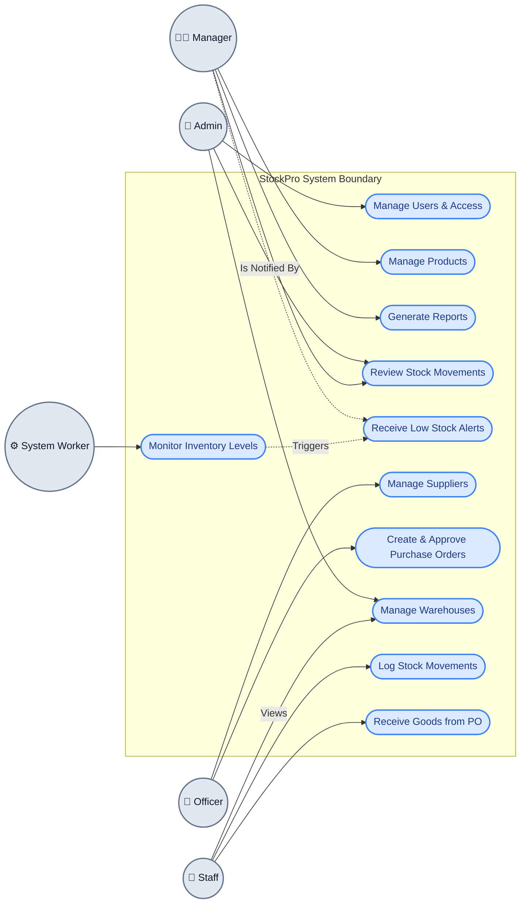
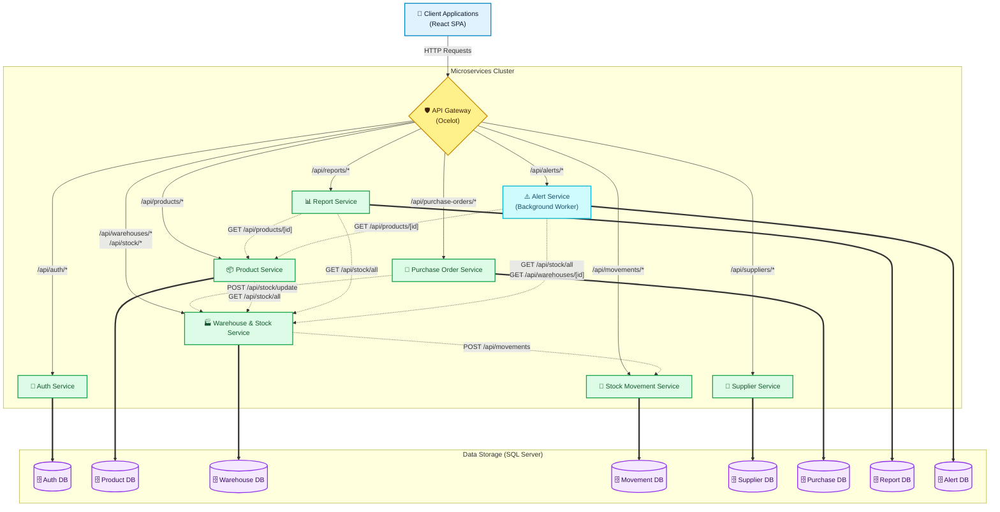
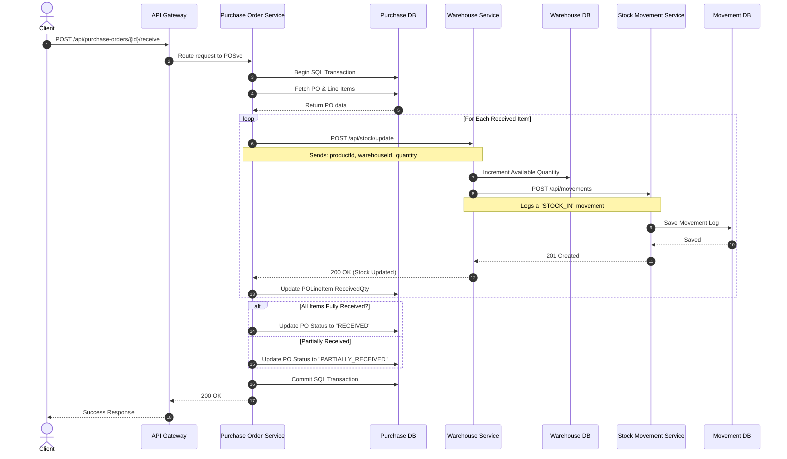
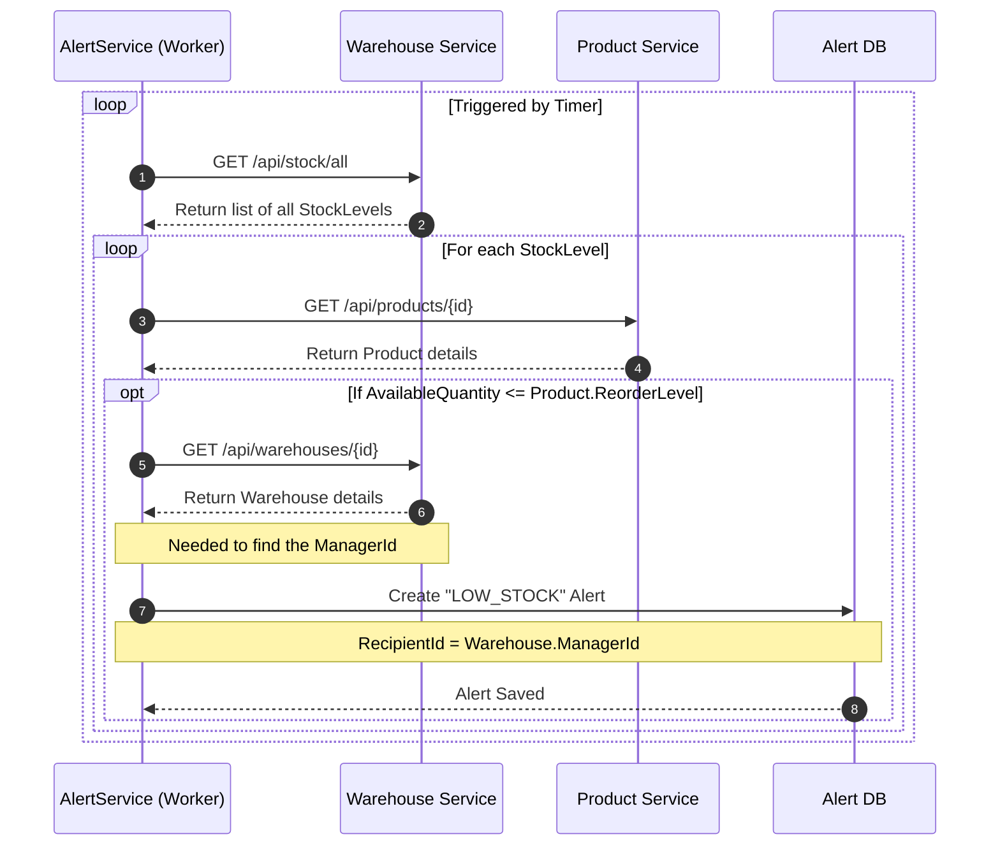
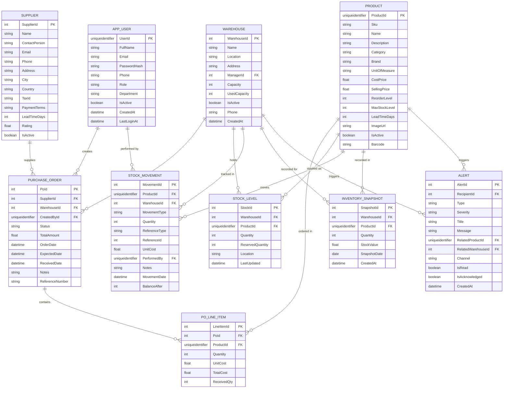

# StockPro — Backend API

> A microservices-based inventory management system built with **ASP.NET Core**, **Entity Framework Core**, **SQL Server**, and an **Ocelot API Gateway**.

---

## System Use Case Diagram

Based on the explicit Role-Based Access Control (RBAC) rules (ADMIN, MANAGER, OFFICER, STAFF), the following diagram maps out the primary actors and the operations they are authorized to perform.



### Role Authorization Breakdown:
* **Admin:** Has system-wide access, including creating users and defining core infrastructure like warehouses.
* **Manager:** Primarily handles analytics, product catalogs, and receives alerts when stock dips below safe thresholds.
* **Officer:** Focused on procurement. They define suppliers and draft/approve Purchase Orders.
* **Staff:** The boots-on-the-ground warehouse workers. They physically receive goods and log ad-hoc stock movements.
* **System Worker:** The automated `AlertService` background job that monitors inventory levels seamlessly.

---

## Microservices Architecture & Connectivity

StockPro is structured as a collection of independent microservices, each owning its own database and exposed through a unified API Gateway.



### Key Architectural Characteristics
* **API Gateway Pattern:** All external traffic is routed through the Ocelot API Gateway which forwards requests to specific services based on URL prefixes.
* **Database-per-Service:** Each microservice manages its own separate SQL Server database, ensuring loose coupling and isolated data domains.
* **Synchronous Communication:** Services communicate with each other over HTTP using `HttpClient` instead of an asynchronous message broker (like RabbitMQ or Kafka).
* **Background Processing:** The `AlertService` contains a background worker that periodically polls other services to check for low stock thresholds.

Each service follows a consistent layered structure:

```
ServiceName/
├── Controllers/      # HTTP endpoints
├── Services/         # Business logic
├── Repositories/     # Data access layer
├── Entities/         # EF Core models
├── DTOs/             # Request / response models
├── Data/             # DbContext
├── Middleware/       # Global exception handling
└── Migrations/       # EF Core migrations
```

---

## Microservice Internal Workflows (Service Flows)

To visualize how the microservices communicate with one another to accomplish business goals, here are the Sequence Diagrams for the two most complex cross-service flows in the system.

### 1. Flow 1: Receiving Goods for a Purchase Order
When a warehouse manager receives items for an approved Purchase Order, the system must update the PO, update the actual warehouse stock, and log a stock movement record. This involves synchronous communication across **three different microservices**.



### 2. Flow 2: Low Stock Alert Background Job
The `AlertService` contains a background worker (`LowStockWorker.cs`) that runs periodically to check if any products have dipped below their defined reorder levels.



---

## Data Architecture (ER Diagram)

This section provides a logical Entity-Relationship (ER) diagram for the StockPro system. 
**Note:** Because StockPro uses a Database-per-Service architecture, these entities actually live in physically separate SQL Server databases. The relationships mapped here (like `PurchaseOrder` -> `Supplier`) are "logical" relationships that your microservices handle programmatically via IDs.



### Schema Observations & Potential Bugs Noticed
While generating this diagram from your Entity classes, I noticed a few **data type mismatches** for foreign keys across microservices that might cause bugs when you try to join data:
1. `AppUser.UserId` is a `Guid`, but `Warehouse.ManagerId` is an `int`.
2. `AppUser.UserId` is a `Guid`, but `Alert.RecipientId` is an `int`.

You might want to update `ManagerId` and `RecipientId` to be `Guid` properties so they properly map to the Auth Service's `UserId`.

---

## Services

| Service | Port | Responsibility |
|---|---|---|
| **ApiGateway** | 5000 | Single entry point, routes all requests via Ocelot |
| **AuthService** | 5119 | User authentication, JWT token issuance, role management |
| **ProductService** | 5212 | Product catalog CRUD |
| **WarehouseService** | 5019 | Warehouse management and stock levels |
| **StockMovementService** | 5121 | Track stock movements (in/out/transfer) |
| **SupplierService** | 5230 | Supplier management |
| **PurchaseOrderService** | 5189 | Purchase order lifecycle |
| **AlertService** | 5245 | Low-stock and threshold alerts |
| **ReportService** | 5144 | Reporting and analytics |

---

## Tech Stack

- **Runtime**: .NET 8 / ASP.NET Core
- **ORM**: Entity Framework Core
- **Database**: SQL Server (SQL Express for local dev)
- **API Gateway**: Ocelot
- **Auth**: JWT Bearer tokens
- **API Docs**: Swagger / OpenAPI (per service)

---

## Prerequisites

- [.NET 8 SDK](https://dotnet.microsoft.com/download)
- SQL Server or SQL Server Express
- Git

---

## Getting Started

### 1. Clone the repository

```bash
git clone <repository-url>
cd StockPro
```

### 2. Configure connection strings

Each service has its own `appsettings.json`. Update the `DefaultConnection` string to point to your SQL Server instance.

**Example** (`AuthService/appsettings.json`):
```json
{
  "ConnectionStrings": {
    "DefaultConnection": "Server=localhost\\SQLEXPRESS;Database=AuthDB;Trusted_Connection=True;TrustServerCertificate=True;"
  },
  "Jwt": {
    "Key": "YOUR_SECRET_KEY_HERE",
    "Issuer": "StockPro",
    "Audience": "StockProUsers"
  }
}
```

Repeat for each service, using a separate database name per service (e.g., `ProductDB`, `WarehouseDB`, etc.).

### 3. Run database migrations

Run migrations for each service from the solution root:

```bash
dotnet ef database update --project AuthService
dotnet ef database update --project ProductService
dotnet ef database update --project WarehouseService
dotnet ef database update --project StockMovementService
dotnet ef database update --project SupplierService
dotnet ef database update --project PurchaseOrderService
dotnet ef database update --project AlertService
dotnet ef database update --project ReportService
```

### 4. Start all services

Open a terminal for each service and run:

```bash
dotnet run --project ApiGateway
dotnet run --project AuthService
dotnet run --project ProductService
dotnet run --project WarehouseService
dotnet run --project StockMovementService
dotnet run --project SupplierService
dotnet run --project PurchaseOrderService
dotnet run --project AlertService
dotnet run --project ReportService
```

All client traffic should be routed through the gateway at `http://localhost:5000`.

---

## API Documentation

Each service exposes a Swagger UI at:

```
http://localhost:{PORT}/swagger
```

All secured endpoints require a **Bearer JWT token** in the `Authorization` header:

```
Authorization: Bearer <your_token>
```

Obtain a token via `POST /api/auth/login` through the gateway.

---

## Authentication & Authorization

- JWT tokens are issued by **AuthService** on successful login.
- Tokens include the user's **role** (`Admin` / `User`).
- Every downstream service validates the JWT independently.
- Role-based access is enforced at the controller level via `[Authorize(Roles = "...")]`.

> **Note:** User registration is restricted to administrators only. New accounts must be created by an existing admin.

---

## Testing

Each service has a corresponding test project (e.g., `AuthService.Tests`, `ProductService.Tests`).

Run all tests from the solution root:

```bash
dotnet test
```

---

## Project Structure

```
StockPro/
├── ApiGateway/
├── AuthService/
├── AuthService.Tests/
├── ProductService/
├── ProductService.Tests/
├── WarehouseService/
├── WarehouseService.Tests/
├── StockMovementService/
├── StockMovementService.Tests/
├── SupplierService/
├── SupplierService.Tests/
├── PurchaseOrderService/
├── PurchaseOrderService.Tests/
├── AlertService/
├── AlertService.Tests/
├── ReportService/
├── ReportService.Tests/
└── StockPro.sln
```

---
